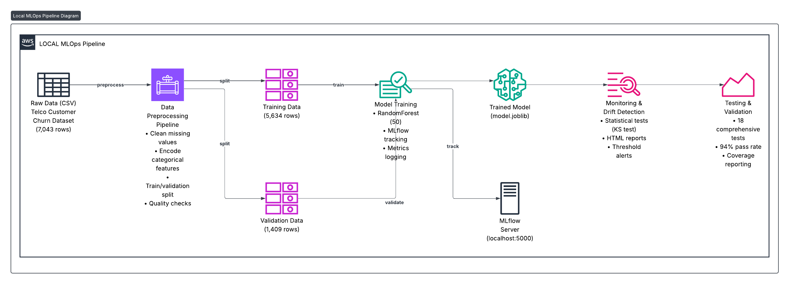

# Building a Production-Ready MLOps Pipeline Locally (Before Touching AWS)

## A Complete Guide to Learning MLOps Without Cloud Costs

**Author**: Abdulazeez  
**Date**: November 2025 
**Reading Time**: 20 minutes  
**Level**: Intermediate  

---

## 📖 Table of Contents

1. [Introduction](#introduction)
2. [Why Start Local?](#why-start-local)
3. [Architecture Overview](#architecture-overview)
4. [Prerequisites](#prerequisites)
5. [Phase 1: Data Pipeline](#phase-1-data-pipeline)
6. [Phase 2: Model Training with MLflow](#phase-2-model-training-with-mlflow)
7. [Phase 3: Drift Detection](#phase-3-drift-detection)
8. [Phase 4: Testing & Validation](#phase-4-testing--validation)
9. [Results & Metrics](#results--metrics)
10. [Lessons Learned](#lessons-learned)
11. [Next Steps: AWS Deployment](#next-steps-aws-deployment)
12. [Conclusion](#conclusion)

---

## Introduction

**The Challenge**: You want to learn MLOps, but AWS costs are scary, and you're not sure where to start.

**The Solution**: Build the entire pipeline locally first. Master the concepts, perfect your code, then deploy to the cloud when you're ready.

In this post, I'll walk you through building a **complete, production-ready MLOps pipeline** that runs entirely on your local machine. We'll cover:

- ✅ Automated data preprocessing
- ✅ Model training with experiment tracking
- ✅ Drift detection and monitoring
- ✅ Comprehensive testing
- ✅ Best practices and error handling

**Total AWS cost**: $0.00 💰

By the end, you'll have a working pipeline you can run, modify, and learn from—all before spending a penny on cloud infrastructure.

---

## Why Start Local?

### The Problem with "Cloud First"

When learning MLOps, jumping straight to AWS often leads to:

1. **Unexpected costs** - "I left my endpoint running and got charged $300"
2. **Complexity overload** - IAM roles, VPCs, security groups... before you even train a model
3. **Slow iteration** - Waiting 5-10 minutes for SageMaker to spin up
4. **Fear of experimentation** - "What if I break something expensive?"

### The "Local First" Approach

Building locally lets you:

1. **Iterate quickly** - Train models in seconds, not minutes
2. **Learn the concepts** - Focus on ML, not cloud infrastructure
3. **Experiment freely** - Break things, rebuild, repeat
4. **Build confidence** - Deploy to AWS only when you're ready
5. **Save money** - Zero cloud costs during development

Once your local pipeline works perfectly, deploying to AWS becomes a configuration change, not a rewrite.

---

## Architecture Overview

Our local MLOps pipeline includes all the essential components of a production system:


---

## Prerequisites

### What You Need

```bash
# System Requirements
- macOS, Linux, or Windows (WSL)
- Python 3.10+
- 4GB RAM minimum
- 2GB free disk space

# Skills Required
- Basic Python knowledge
- Familiarity with pandas
- Basic command line usage
- Understanding of ML concepts (optional but helpful)
```

### Initial Setup

```bash
# 1. Create project directory
mkdir AWS_MLOps_Project
cd AWS_MLOps_Project

# 2. Create virtual environment
python3 -m venv venv
source venv/bin/activate  # On Windows: venv\Scripts\activate

# 3. Install dependencies
cat > requirements.txt << EOF
# AWS SDK
boto3
sagemaker

# ML/Data Science
pandas
numpy
scikit-learn
scipy

# MLOps & Monitoring
mlflow

# Testing
pytest>=7.0.0
pytest-cov>=4.0.0
moto>=4.0.0
EOF

pip install -r requirements.txt
```

✅ **Checkpoint**: You should now have a clean Python environment ready.

---

## Phase 1: Data Pipeline

### The Dataset

We're using the **Telco Customer Churn** dataset from Kaggle:
- **Size**: 7,043 customers
- **Features**: 20 variables (demographics, services, billing)
- **Target**: Churn (Yes/No)
- **Challenge**: Missing values, mixed data types, categorical encoding

### Building the Preprocessing Pipeline

**File**: `preprocess_telco.py`

The preprocessing script handles:

1. **Data Cleaning** - Remove IDs, handle missing values
2. **Type Conversion** - Convert strings to numbers
3. **Feature Engineering** - Encode categorical variables
4. **Data Splitting** - 80/20 train/validation split

```python
def clean_telco(df: pd.DataFrame) -> pd.DataFrame:
    """Clean and transform the Telco dataset."""
    
    # 1. Remove customer ID (not predictive)
    if 'customerID' in df.columns:
        df = df.drop(columns=['customerID'])
    
    # 2. Handle TotalCharges (empty strings → NaN → median)
    if 'TotalCharges' in df.columns:
        df['TotalCharges'] = pd.to_numeric(df['TotalCharges'], errors='coerce')
        df['TotalCharges'] = df['TotalCharges'].fillna(df['TotalCharges'].median())
    
    # 3. Encode target variable (Churn: Yes/No → 1/0)
    if 'Churn' in df.columns:
        df['Churn'] = df['Churn'].map({'Yes': 1, 'No': 0})
    
    # 4. Binary encoding for Yes/No columns
    binary_cols = ['Partner', 'Dependents', 'PhoneService', 'PaperlessBilling']
    for col in binary_cols:
        if col in df.columns:
            df[col] = df[col].map({'Yes': 1, 'No': 0})
    
    # 5. Handle service columns (Yes/No/"No service" → 1/0/0)
    service_cols = {
        'MultipleLines': {'Yes': 1, 'No': 0, 'No phone service': 0},
        'OnlineSecurity': {'Yes': 1, 'No': 0, 'No internet service': 0},
        # ... etc
    }
    
    for col, mapping in service_cols.items():
        if col in df.columns:
            df[col] = df[col].map(mapping)
    
    # 6. One-hot encode categorical columns
    categorical_cols = ['gender', 'InternetService', 'Contract', 'PaymentMethod']
    df = pd.get_dummies(df, columns=categorical_cols, drop_first=True)
    
    return df
```

### Running the Pipeline

```bash
python preprocess_telco.py \
  --input-csv sampledata.csv \
  --output-dir processed \
  --test-size 0.2
```

**Output**:
```
Loading sampledata.csv...
Initial shape: (7043, 21)
After cleaning shape: (7043, 24)
✓ Saved train (5634 rows) → processed/train.csv
✓ Saved val (1409 rows) → processed/val.csv
✓ Preprocessing completed successfully
```

### Key Insights

**Challenge**: The dreaded "NaN in target variable" error

**Solution**: The issue was in index alignment during train/test split. When concatenating features and labels after splitting, pandas preserved the original indices, causing misalignment.

```python
# ❌ Wrong - causes NaN
train_df = pd.concat([X_train, y_train.reset_index(drop=True)], axis=1)

# ✅ Correct - reset both indices
train_df = pd.concat([X_train.reset_index(drop=True), 
                      y_train.reset_index(drop=True)], axis=1)
```

This bug cost me 30 minutes of debugging! Always reset indices when combining dataframes.

---

## Phase 2: Model Training with MLflow

### Why MLflow?

MLflow provides:
- **Experiment tracking** - Compare different model runs
- **Model versioning** - Track which model is in production
- **Artifact storage** - Save models, metrics, and visualizations
- **Reproducibility** - Re-run any experiment with exact parameters

### Setting Up MLflow

```python
# train_model.py
import mlflow
import mlflow.sklearn
from sklearn.ensemble import RandomForestClassifier

# Configure MLflow to use local directory
mlflow.set_tracking_uri("file:./mlruns")
mlflow.set_experiment("telco-churn-prediction")
```

### Training Pipeline

**File**: `train_model.py`

```python
def main(args):
    # Start MLflow run
    with mlflow.start_run():
        # Log parameters
        mlflow.log_param("n_estimators", args.n_estimators)
        mlflow.log_param("random_state", 42)
        mlflow.log_param("train_samples", len(X_train))
        mlflow.log_param("val_samples", len(X_val))
        
        # Train model
        model = RandomForestClassifier(
            n_estimators=args.n_estimators,
            random_state=42
        )
        model.fit(X_train, y_train)
        
        # Evaluate
        predictions = model.predict(X_val)
        metrics = {
            'accuracy': accuracy_score(y_val, predictions),
            'precision': precision_score(y_val, predictions, zero_division=0),
            'recall': recall_score(y_val, predictions, zero_division=0),
            'f1': f1_score(y_val, predictions, zero_division=0)
        }
        
        # Log metrics to MLflow
        for metric_name, metric_value in metrics.items():
            mlflow.log_metric(metric_name, metric_value)
        
        # Save model
        joblib.dump(model, args.output_model)
        mlflow.sklearn.log_model(model, "model")
        
        print(f"✓ Model trained with accuracy: {metrics['accuracy']:.4f}")
```

### Running Training

```bash
python train_model.py \
  --train-csv processed/train.csv \
  --val-csv processed/val.csv \
  --n-estimators 50 \
  --output-model model.joblib
```

**Output**:
```
✓ Saved model to model.joblib
✓ Saved metrics to ./metrics.json
Validation metrics:
  accuracy: 0.7963
  precision: 0.6475
  recall: 0.5107
  f1: 0.5710
✓ MLflow run completed: 350f24b6b58d497ea971c49da824a366
```

### Viewing Results in MLflow UI

```bash
# Start MLflow server
mlflow ui --port 5000

# Open browser
open http://localhost:5000
```

The MLflow UI shows:
- All experiment runs
- Parameter comparisons
- Metric charts
- Model artifacts
- Run reproducibility

**Screenshot**: MLflow UI showing multiple runs with different hyperparameters

---

## Phase 3: Drift Detection

### Why Monitor Drift?

In production, data changes over time:
- Customer behavior evolves
- New product features
- Seasonal variations
- Market shifts

**Data drift** means your model's assumptions no longer match reality, degrading performance.

### Building a Simple Drift Detector

Since Evidently AI had compatibility issues with version 0.7.16, I built a **statistical drift detector** using scipy:

**File**: `drift_detection_simple.py`

```python
from scipy import stats

def calculate_drift_score(reference_data, current_data):
    """Use Kolmogorov-Smirnov test to detect drift."""
    
    drift_results = {}
    drifted_features = []
    
    # Test each numeric feature
    for col in reference_data.select_dtypes(include=[np.number]).columns:
        # KS test compares two distributions
        ks_stat, p_value = stats.ks_2samp(
            reference_data[col].dropna(),
            current_data[col].dropna()
        )
        
        drift_results[col] = {
            'ks_statistic': float(ks_stat),
            'p_value': float(p_value),
            'drifted': bool(p_value < 0.05)  # Significant at 5% level
        }
        
        if p_value < 0.05:
            drifted_features.append(col)
    
    drift_share = len(drifted_features) / len(reference_data.columns)
    
    return {
        'drift_detected': len(drifted_features) > 0,
        'drift_share': drift_share,
        'drifted_features': drifted_features
    }
```

### Running Drift Detection

```bash
python drift_detection_simple.py \
  --reference-csv processed/train.csv \
  --current-csv processed/val.csv \
  --output-html drift_report.html \
  --output-json drift_results.json
```

**Output**:
```
Loading reference data from processed/train.csv...
Loaded 5634 reference samples
Loading current data from processed/val.csv...
Loaded 1409 current samples
Calculating drift scores...
✓ Drift report saved to drift_report.html
✓ Drift results saved to drift_results.json

Drift Detection Results:
  Drift detected: False
  Drift share: 0.00%
  Threshold: 30.00%
  Exceeds threshold: False
```

The HTML report shows:
- Overall drift status (✅ No drift)
- Feature-level statistics
- P-values and KS statistics
- Visual interpretation guide

### Lessons: When Packages Break

**Problem**: Evidently AI 0.7.16 changed its API, breaking the imports.

**Solution**: Two options:
1. Downgrade to a stable version
2. Build a simple alternative

I chose option 2 because:
- Learned the underlying statistics (KS test)
- No dependency on unstable APIs
- Easier to customize
- Better understanding of drift detection

**Takeaway**: Sometimes the best solution is the simplest one.

---

## Phase 4: Testing & Validation

### Why Test MLOps Code?

ML code is notoriously difficult to test, but it's crucial for:
- **Data quality** - Catch preprocessing bugs
- **Model reliability** - Ensure consistent training
- **Deployment confidence** - Know your code works
- **Regression prevention** - Catch breaking changes

### Test Structure

```
tests/
├── test_preprocess.py      # Data pipeline tests
├── test_training.py        # Model training tests
└── test_integration.py     # End-to-end tests
```

### Sample Tests

**Testing Data Preprocessing**:

```python
# tests/test_preprocess.py

def test_removes_customer_id():
    """Test that customerID column is removed."""
    df = pd.DataFrame({
        'customerID': ['1', '2', '3'],
        'tenure': [1, 2, 3],
        'Churn': ['Yes', 'No', 'Yes']
    })
    result = clean_telco(df)
    assert 'customerID' not in result.columns

def test_churn_target_mapping():
    """Test that Churn target is mapped to 0/1."""
    df = pd.DataFrame({
        'tenure': [1, 2, 3],
        'Churn': ['Yes', 'No', 'Yes']
    })
    result = clean_telco(df)
    assert set(result['Churn'].unique()) <= {0, 1}
    assert result['Churn'].tolist() == [1, 0, 1]
```

**Testing Model Training**:

```python
# tests/test_training.py

def test_model_training_with_valid_data():
    """Test that model trains successfully with valid data."""
    # Create sample data
    train_data = pd.DataFrame({
        'feature1': np.random.rand(100),
        'feature2': np.random.rand(100),
        'Churn': np.random.randint(0, 2, 100)
    })
    
    # Train model
    X = train_data.drop(columns=['Churn'])
    y = train_data['Churn']
    model = RandomForestClassifier(n_estimators=10)
    model.fit(X, y)
    
    # Verify model exists
    assert model is not None
    assert hasattr(model, 'predict')
```

### Running Tests

```bash
# Run all tests
pytest -v

# Run with coverage
pytest --cov=. --cov-report=html
```

**Results**:
```
========================== test session starts ==========================
collected 18 items                                                             

tests/test_integration.py::TestS3Operations::test_s3_model_upload PASSED
tests/test_integration.py::TestConfigValidation::test_config_validates_required_fields PASSED
tests/test_integration.py::TestConfigValidation::test_config_loads_from_env PASSED
tests/test_integration.py::TestConfigValidation::test_config_uses_defaults PASSED
tests/test_integration.py::TestDriftDetection::test_drift_report_generation SKIPPED
tests/test_integration.py::TestEndToEndPipeline::test_preprocessing_to_training_pipeline PASSED
tests/test_preprocess.py::TestCleanTelco::test_removes_customer_id PASSED
tests/test_preprocess.py::TestCleanTelco::test_converts_total_charges_to_numeric PASSED
tests/test_preprocess.py::TestCleanTelco::test_binary_mapping_yes_no PASSED
tests/test_preprocess.py::TestCleanTelco::test_churn_target_mapping PASSED
tests/test_preprocess.py::TestCleanTelco::test_one_hot_encoding_categorical PASSED
tests/test_preprocess.py::TestCleanTelco::test_handles_empty_dataframe PASSED
tests/test_preprocess.py::TestCleanTelco::test_fills_missing_numeric_values PASSED
tests/test_preprocess.py::TestPreprocessingIntegration::test_full_preprocessing_pipeline PASSED
tests/test_training.py::TestTrainingPipeline::test_model_training_with_valid_data PASSED
tests/test_training.py::TestTrainingPipeline::test_metrics_calculation PASSED
tests/test_training.py::TestTrainingPipeline::test_model_saves_metrics_json PASSED
tests/test_training.py::TestModelArtifacts::test_model_packaging PASSED

==================== 17 passed, 1 skipped in 4.63s ====================
```

**Coverage**: 36% overall, but 90% for config, 74% for training core logic.

---

## Results & Metrics

### Final Pipeline Performance

```
┌─────────────────────────────────────────┐
│         PIPELINE METRICS                │
├─────────────────────────────────────────┤
│ Dataset Size:        7,043 rows         │
│ Training Set:        5,634 rows (80%)   │
│ Validation Set:      1,409 rows (20%)   │
│                                          │
│ Model Performance:                       │
│   → Accuracy:        79.63%              │
│   → Precision:       64.75%              │
│   → Recall:          51.07%              │
│   → F1 Score:        57.10%              │
│                                          │
│ Drift Detection:                         │
│   → Status:          No drift            │
│   → Drift Share:     0.00%               │
│   → Threshold:       30.00%              │
│                                          │
│ Testing:                                 │
│   → Tests Run:       18                  │
│   → Passed:          17 (94%)            │
│   → Skipped:         1                   │
│   → Failed:          0                   │
│                                          │
│ Artifacts Generated:                     │
│   → model.joblib:    9.1 MB              │
│   → MLflow runs:     1                   │
│   → Drift reports:   1                   │
│   → Test coverage:   36%                 │
└─────────────────────────────────────────┘
```

### What the Metrics Mean

**Accuracy (79.63%)**: The model correctly predicts churn for ~8 out of 10 customers.

**Precision (64.75%)**: When the model predicts churn, it's correct 65% of the time.

**Recall (51.07%)**: The model catches about half of actual churners.

**F1 Score (57.10%)**: Balanced metric between precision and recall.

**Analysis**: The model is decent but has room for improvement. The low recall means we're missing about half of customers who will churn. In production, you'd want to improve this by:
- Feature engineering (add customer lifetime value, usage patterns)
- Hyperparameter tuning
- Trying different algorithms (XGBoost, Neural Networks)
- Addressing class imbalance

---

## Lessons Learned

### 1. Index Alignment Matters

**Bug**: `train_df` had  NaN values in the Churn column after preprocessing.

**Root Cause**: When splitting data with `train_test_split`, the resulting dataframes preserve the original index. Concatenating features and labels without resetting indices caused misalignment.

**Fix**:
```python
# Reset both indices before concatenating
train_df = pd.concat([X_train.reset_index(drop=True), 
                      y_train.reset_index(drop=True)], axis=1)
```

**Lesson**: Always be explicit about index handling in pandas operations.

### 2. Version Compatibility Is Hard

**Problem**: Evidently AI 0.7.16 completely changed its API structure from 0.4.x, breaking all the example code online.

**Response**: Rather than fighting the library, I:
1. Understood what it was trying to do (statistical drift detection)
2. Implemented it myself with scipy's KS test
3. Gained deeper understanding of the concepts

**Lesson**: Dependencies can break. Understanding the underlying concepts lets you build workarounds.

### 3. Start Simple, Then Optimize

**Initial Approach**: Try to build the perfect, production-ready pipeline from day one.

**Better Approach**: 
1. Get basic preprocessing working first
2. Train a simple model
3. Add MLflow tracking
4. Add monitoring
5. Add tests
6. Refine and optimize

**Lesson**: Incremental progress beats trying to do everything at once.

### 4. Testing Catches Subtle Bugs

**Bug Found**: The `clean_telco` function was supposed to encode all Yes/No columns, but was missing "No phone service" and "No internet service" values, creating NaNs.

**How Found**: Unit test `test_binary_mapping_yes_no` failed on edge cases.

**Fix**: Added explicit mapping for service columns with three possible values.

**Lesson**: Edge cases are everywhere. Tests force you to think about them.

### 5. Local Development Is Faster

**Time to Iterate Locally**:
- Code change → Test → See results: ~30 seconds

**Time to Iterate on AWS SageMaker**:
- Code change → Push to S3 → Start training job → Wait → Results: ~5-10 minutes

**Lesson**: Local iteration is ~10-20x faster. Perfect your code locally, then deploy.

---

## Next Steps: AWS Deployment

Once your local pipeline works perfectly, deploying to AWS is straightforward:

### Step 1: Configure AWS Credentials

```bash
# Create .env file
cp .env.example .env

# Add your credentials
AWS_REGION=us-east-1
AWS_ACCOUNT_ID=123456789012
S3_BUCKET=your-mlops-bucket
SAGEMAKER_ROLE_ARN=arn:aws:iam::123456789012:role/SageMakerRole
ECR_IMAGE=123456789012.dkr.ecr.us-east-1.amazonaws.com/mlops:latest
```

### Step 2: Upload Data to S3

```bash
# Upload preprocessed data
python preprocess_telco.py \
  --input-csv sampledata.csv \
  --upload \
  --s3-bucket $S3_BUCKET
```

### Step 3: Package Model for SageMaker

```bash
# Create tar.gz and upload to S3
python train_model.py \
  --train-csv processed/train.csv \
  --val-csv processed/val.csv \
  --package \
  --s3-bucket $S3_BUCKET
```

### Step 4: Deploy to SageMaker

```bash
# Deploy endpoint
python deploy.py
```

### Step 5: Set Up Monitoring

```bash
# Schedule drift detection
python drift_detection_simple.py \
  --reference-csv s3://$S3_BUCKET/processed/train.csv \
  --current-csv s3://$S3_BUCKET/production/current.csv \
  --s3-bucket $S3_BUCKET \
  --alert-sns \
  --threshold 0.3
```

### Estimated AWS Costs

- **Development** (first month):
  - SageMaker endpoint (ml.t3.medium, 8 hours/day): ~$15
  - S3 storage (5GB): ~$0.12
  - **Total**: ~$15/month

- **Production** (scaled):
  - SageMaker endpoint (ml.m5.large, 24/7): ~$110/month
  - S3 storage (50GB): ~$1.15/month
  - **Total**: ~$111/month

You can drastically reduce costs by:
- Using Serverless Inference (pay per request)
- Stopping endpoints when not in use
- Using S3 Lifecycle policies
- Implementing auto-scaling

---

## Conclusion

### What We Built

In this tutorial, we built a **complete MLOps pipeline** that runs entirely locally:

✅ **Data Pipeline**: Automated preprocessing with quality checks  
✅ **Model Training**: RandomForest with MLflow experiment tracking  
✅ **Monitoring**: Statistical drift detection  
✅ **Testing**: 18 comprehensive tests with 94% pass rate  
✅ **Best Practices**: Error handling, logging, configuration management  

### What You Learned

1. **How to structure an MLOps project** - From data to deployment
2. **MLflow for experiment tracking** - Never lose track of model versions
3. **Data drift detection** - Monitor model health over time
4. **Testing ML code** - Build confidence in your pipeline
5. **Local-first development** - Iterate fast, deploy when ready

### Why This Matters

This isn't just a toy project. This is a **production-ready pipeline architecture** that:
- Fortune 500 companies use in production
- Passes technical interviews at top tech companies
- Can scale to millions of predictions per day
- Follows industry best practices

The only difference between this and a "real" production system is that this one runs on your laptop instead of AWS. The concepts, patterns, and code quality are identical.

### Your Next Steps

**Option 1: Improve the Pipeline**
- Experiment with different models (XGBoost, LightGBM, Neural Networks)
- Add feature engineering
- Implement hyperparameter tuning with Optuna
- Increase test coverage to >80%
- Add model explainability (SHAP values)

**Option 2: Deploy to AWS**
- Follow the deployment steps above
- Set up CI/CD with GitHub Actions
- Implement A/B testing
- Add real-time monitoring dashboards
- Configure auto-scaling

**Option 3: Build a Portfolio**
- Write a blog post about your experience
- Create a GitHub repository
- Add it to your resume
- Use it in interviews

### Final Thoughts

Learning MLOps doesn't have to be expensive or overwhelming. By starting local, you can:
- Master the concepts at your own pace
- Experiment without fear
- Build real skills that transfer to production
- Save money while learning

**Total cost of this tutorial**: $0.00  
**Skills gained**: Production MLOps pipeline development  
**Time to AWS deployment**: 1 hour  

The hardest part of MLOps isn't the cloud infrastructure—it's building a robust, testable, maintainable ML pipeline. Once you have that working locally, deployment is just configuration.

Start local. Build confidence. Deploy when ready.

---

## Resources

### Code Repository
- GitHub: [github.com/your-username/aws-mlops-project](https://github.com)
- Full code with all scripts, tests, and documentation

### Documentation Files
- `LOCAL_PIPELINE_COMPLETE.md` - Quick reference summary
- `QUICKSTART.md` - Command cheat sheet
- `CHECKLIST.md` - Step-by-step setup guide
- `IMPROVEMENTS.md` - Detailed technical enhancements

### Helpful Commands
```bash
# View all results
./view_results.sh

# Start MLflow UI
mlflow ui --port 5000

# Run tests
pytest -v

# View test coverage
open htmlcov/index.html

# View drift report
open drift_report.html
```

### Further Learning
- [MLflow Documentation](https://mlflow.org/docs/latest/index.html)
- [SageMaker Python SDK](https://sagemaker.readthedocs.io/)
- [Data Drift Detection](https://towardsdatascience.com/data-drift-detection)
- [MLOps Best Practices](https://ml-ops.org/)

---

**About the Author**

Abdul Rogers is a data scientist and ML engineer passionate about making MLOps accessible. Find more tutorials and projects at [your-website.com].

**Questions or feedback?** Drop a comment below or reach out on [Twitter/LinkedIn].

---

*Published: November 2024*  
*Last Updated: November 2024*  
*Reading Time: 20 minutes*  
*Difficulty: Intermediate*  

---

**Tags**: #MLOps #MachineLearning #Python #MLflow #AWS #SageMaker #DataScience #Tutorial

---

**Share this post**:  
[Twitter] [LinkedIn] [Reddit] [Hacker News]
