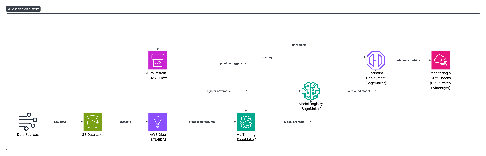

## 🧠 Comprehensive AWS MLOps Project Guide

End-to-End ML Pipeline Deployment with Amazon SageMaker, CloudWatch, MLflow, and Evidently AI

This guide provides a detailed, hands-on walkthrough for building, deploying, and monitoring a complete ML lifecycle with AWS SageMaker. It includes automated deployment to SageMaker Endpoints, CI/CD integration, CloudWatch Monitoring, MLflow experiment tracking, and Evidently AI drift detection.


## 🚀 Architecture Overview



### Architecture Components

1. **Data Pipeline**: Preprocessing with `preprocess_telco.py`
2. **Training Pipeline**: Model training with MLflow tracking (`train_model.py`)
3. **Deployment**: SageMaker endpoint deployment (`deploy.py`)
4. **Monitoring**: Drift detection with Evidently AI (`drift_detection.py`)
5. **CI/CD**: AWS CodePipeline + GitHub Actions integration
6. **Infrastructure**: Terraform for IaC

## 📋 Prerequisites

### Required

- **AWS Account** with permissions for:
  - S3 (bucket creation, read/write)
  - SageMaker (model deployment, endpoints)
  - IAM (role creation and management)
  - ECR (container registry)
  - CloudWatch (logging and monitoring)
  - EventBridge (optional, for automation)
  - Lambda (optional, for triggers)
  - SNS (optional, for alerts)

- **Tools Installed**:
  - Python 3.10+
  - AWS CLI (configured with credentials)
  - Git
  - Terraform (optional, for infrastructure provisioning)

### Optional but Recommended

- Docker (for custom container images)
- MLflow (for experiment tracking UI)
- VS Code or PyCharm (for development)

## 🚀 Quick Start (5 Minutes)

### 1. Clone and Setup

```bash
# Clone the repository
git clone <your-repo-url>
cd AWS_MLOps_Project

# Create virtual environment
python3 -m venv venv
source venv/bin/activate  # On Windows: venv\Scripts\activate

# Install dependencies
pip install -r requirements.txt
```

### 2. Configure Environment

```bash
# Copy environment template
cp .env.example .env

# Edit with your AWS credentials
nano .env  # or use your preferred editor
```

**Required environment variables in `.env`**:
```bash
AWS_REGION=us-east-1
AWS_ACCOUNT_ID=123456789012
S3_BUCKET=your-unique-bucket-name
SAGEMAKER_ROLE_ARN=arn:aws:iam::123456789012:role/SageMakerRole
ECR_IMAGE=123456789012.dkr.ecr.us-east-1.amazonaws.com/mlops:latest
```

### 3. Verify Setup

```bash
# Run tests to verify installation
pytest -v

# All tests should pass ✅
```

## 📊 Complete Step-by-Step Implementation

### Step 0: Environment Configuration (NEW)

**Set up centralized configuration** using the new config system:

```bash
# 1. Copy the environment template
cp .env.example .env

# 2. Edit the .env file with your values
nano .env

# Required variables:
# - AWS_REGION
# - S3_BUCKET
# - SAGEMAKER_ROLE_ARN
# - ECR_IMAGE

# Optional variables:
# - MODEL_NAME (default: mlops-model-v1)
# - ENDPOINT_NAME (default: mlops-endpoint)
# - SNS_TOPIC_ARN (for alerts)
# - MLFLOW_TRACKING_URI (default: http://localhost:5000)
# - DRIFT_THRESHOLD (default: 0.3)
```

**Verify configuration**:
```python
from config import config

# Check if all required fields are set
missing = config.validate()
if missing:
    print(f"Missing: {', '.join(missing)}")
else:
    print("✓ Configuration valid!")
```

### Step 1: Setup Your AWS Environment

**Create S3 bucket** (if not exists):

```bash
# Using AWS CLI
aws s3 mb s3://$S3_BUCKET --region $AWS_REGION

# Enable versioning
aws s3api put-bucket-versioning \
  --bucket $S3_BUCKET \
  --versioning-configuration Status=Enabled

# Enable encryption
aws s3api put-bucket-encryption \
  --bucket $S3_BUCKET \
  --server-side-encryption-configuration '{
    "Rules": [{
      "ApplyServerSideEncryptionByDefault": {
        "SSEAlgorithm": "AES256"
      }
    }]
  }'
```

**Create SageMaker execution role**:

```bash
# Create IAM role (see docs/iam/sagemaker_role_policy.json for policy)
aws iam create-role \
  --role-name SageMakerMLOpsRole \
  --assume-role-policy-document file://docs/iam/sagemaker_trust_policy.json

# Attach policy
aws iam put-role-policy \
  --role-name SageMakerMLOpsRole \
  --policy-name SageMakerMLOpsPolicy \
  --policy-document file://docs/iam/sagemaker_role_policy.json

# Get the ARN
aws iam get-role --role-name SageMakerMLOpsRole --query 'Role.Arn'
# Add this ARN to your .env file as SAGEMAKER_ROLE_ARN
```

**Create SNS topic for alerts** (optional):

```bash
aws sns create-topic --name mlops-alerts
aws sns subscribe \
  --topic-arn arn:aws:sns:$AWS_REGION:$ACCOUNT_ID:mlops-alerts \
  --protocol email \
  --notification-endpoint your-email@example.com
```

### Step 2: Data Preprocessing

**Download the Telco Customer Churn dataset** from [Kaggle](https://www.kaggle.com/datasets/blastchar/telco-customer-churn):

```bash
# After downloading, extract the CSV
unzip telco-customer-churn.zip
```

**Preprocess locally**:

```bash
python preprocess_telco.py \
  --input-csv WA_Fn-UseC_-Telco-Customer-Churn.csv \
  --output-dir processed \
  --test-size 0.2
```

**Output**:
- `processed/train.csv` - Training data (80%)
- `processed/val.csv` - Validation data (20%)

**Upload to S3** (optional):

```bash
python preprocess_telco.py \
  --input-csv WA_Fn-UseC_-Telco-Customer-Churn.csv \
  --output-dir processed \
  --upload --s3-bucket $S3_BUCKET
```

**What it does**:
- Removes customer IDs
- Handles missing values (fills with median)
- Encodes categorical variables (one-hot encoding)
- Binary encoding for Yes/No fields
- Stratified train/validation split

### Step 3: Model Training with MLflow 

**Start MLflow tracking server** (in separate terminal):

```bash
# Start MLflow UI
mlflow ui --host 0.0.0.0 --port 5000

# Access at http://localhost:5000
```

**Train model locally**:

```bash
python train_model.py \
  --train-csv processed/train.csv \
  --val-csv processed/val.csv \
  --n-estimators 100 \
  --output-model model.joblib
```

**What happens**:
- ✅ Model training with RandomForest
- ✅ Automatic MLflow experiment logging
- ✅ Parameters logged (n_estimators, random_state, etc.)
- ✅ Metrics logged (accuracy, precision, recall, F1)
- ✅ Model artifacts saved to MLflow
- ✅ Local model saved as `model.joblib`
- ✅ Metrics saved to `metrics.json`

**View results in MLflow UI**:
- Open http://localhost:5000
- Navigate to the "telco-churn-prediction" experiment
- Compare runs, parameters, and metrics

**Train and package for SageMaker**:

```bash
python train_model.py \
  --train-csv processed/train.csv \
  --val-csv processed/val.csv \
  --n-estimators 100 \
  --package \
  --s3-bucket $S3_BUCKET \
  --aws-region $AWS_REGION
```

**Output**:
- `model.tar.gz` uploaded to S3 at `s3://$S3_BUCKET/models/model.tar.gz`
- MLflow run with S3 URI logged

### Step 4: Model Registration (SageMaker Model Registry)

Using SageMaker Python SDK:

```python
from sagemaker.sklearn.estimator import SKLearn
from sagemaker import get_execution_role, Session

role = get_execution_role()
sess = Session()

# Register the model
sklearn_estimator = SKLearn(
    entry_point='train_model.py',
    role=role,
    instance_type='ml.m5.xlarge',
    framework_version='1.0-1'
)

# Create model package
model_package_arn = sklearn_estimator.register(
    content_types=['text/csv'], 
    response_types=['text/csv'],
    inference_instances=['ml.m5.large'], 
    transform_instances=['ml.m5.xlarge'],
    model_package_group_name='telco-churn-models'
)
```

### Step 5: Deployment to SageMaker Endpoints

**Deploy using the automated script**:

```bash
# Ensure .env is configured with:
# - S3_BUCKET
# - ECR_IMAGE
# - SAGEMAKER_ROLE_ARN

python deploy.py
```

**What it does**:
1. Validates configuration
2. Checks if model artifact exists in S3
3. Creates SageMaker Model
4. Creates Endpoint Configuration
5. Creates and deploys Endpoint
6. Polls until endpoint is InService (~5-10 minutes)

**Manual deployment** (alternative):

```python
import boto3
from config import config

sm = boto3.client('sagemaker', region_name=config.aws_region)

# Create model
sm.create_model(
    ModelName=config.model_name,
    ExecutionRoleArn=config.sagemaker_role_arn,
    PrimaryContainer={
        'Image': config.ecr_image,
        'ModelDataUrl': f's3://{config.s3_bucket}/{config.s3_key}'
    }
)

# Create endpoint config
sm.create_endpoint_config(
    EndpointConfigName=f'{config.endpoint_name}-config',
    ProductionVariants=[{
        'VariantName': 'AllTraffic',
        'ModelName': config.model_name,
        'InitialInstanceCount': 1,
        'InstanceType': 'ml.m5.large'
    }]
)

# Create endpoint
sm.create_endpoint(
    EndpointName=config.endpoint_name,
    EndpointConfigName=f'{config.endpoint_name}-config'
)
```

**Test the endpoint**:

```python
import boto3
import json

runtime = boto3.client('sagemaker-runtime')

# Sample payload
payload = json.dumps({
    "tenure": 12,
    "MonthlyCharges": 70.5,
    # ... other features
})

response = runtime.invoke_endpoint(
    EndpointName='mlops-endpoint',
    ContentType='application/json',
    Body=payload
)

prediction = response['Body'].read()
print(f"Prediction: {prediction}")
```

### Step 6: Monitoring and Drift Detection

**Enable data capture** on SageMaker endpoint:

```python
from sagemaker.model_monitor import DataCaptureConfig

data_capture_config = DataCaptureConfig(
    enable_capture=True,
    sampling_percentage=100,
    destination_s3_uri=f's3://{config.s3_bucket}/data-capture/'
)

# Apply to endpoint during creation
```

**Run drift detection with Evidently AI**:

```bash
# Basic drift detection
python drift_detection.py \
  --reference-csv processed/train.csv \
  --current-csv production/current_week.csv \
  --output-html drift_report.html \
  --output-json drift_results.json
```

**Output**:
- `drift_report.html` - Interactive visualization with charts
- `drift_results.json` - Machine-readable metrics

**Example drift_results.json**:
```json
{
  "drift_detected": true,
  "drift_share": 0.35,
  "timestamp": "2024-11-25T20:51:19"
}
```

**Automated drift monitoring with alerts**:

```bash
python drift_detection.py \
  --reference-csv processed/train.csv \
  --current-csv production/current_week.csv \
  --s3-bucket $S3_BUCKET \
  --s3-key-prefix monitoring/drift/ \
  --alert-sns \
  --threshold 0.3
```

**What happens**:
1. Compares current data to reference (training) data
2. Generates HTML report with visualizations
3. Uploads report to S3 with timestamp
4. If drift > threshold, sends SNS alert
5. Returns exit code 1 if threshold exceeded (for automation)

**Schedule drift detection** (using EventBridge):

```bash
# Create Lambda function that runs drift_detection.py
# Create EventBridge rule to trigger weekly
aws events put-rule \
  --name weekly-drift-check \
  --schedule-expression 'rate(7 days)'

aws events put-targets \
  --rule weekly-drift-check \
  --targets "Id"="1","Arn"="<lambda-arn>"
```

### Step 7: CI/CD Pipeline Setup

#### Option A: AWS CodePipeline (Recommended)

**Using Terraform**:

```bash
cd terraform/codepipeline

# Create terraform.tfvars
cat > terraform.tfvars << EOF
region = "us-east-1"
artifacts_bucket_name = "mlops-pipeline-artifacts-unique"
s3_bucket = "$S3_BUCKET"
github_owner = "your-github-username"
github_repo = "aws-mlops-project"
branch = "main"
codestar_connection_arn = "arn:aws:codestar-connections:..."
ecr_repo_arn = "arn:aws:ecr:..."
sagemaker_model_arn = "*"
sagemaker_endpoint_arn = "*"
sagemaker_role_arn = "$SAGEMAKER_ROLE_ARN"
EOF

# Initialize and apply
terraform init
terraform plan
terraform apply
```

**What it creates**:
- S3 bucket for pipeline artifacts (with versioning and encryption)
- CodeBuild project with proper IAM roles
- CodePipeline with Source and Build stages
- IAM roles with least-privilege policies

#### Option B: GitHub Actions

**Already configured** in `.github/workflows/ci.yml`:

1. Go to your GitHub repository settings
2. Navigate to Secrets and Variables > Actions
3. Add repository secrets:
   - `AWS_REGION`
   - `S3_BUCKET`
   - `ECR_IMAGE`
   - `SAGEMAKER_ROLE_ARN`

4. Push to main branch to trigger pipeline:
```bash
git add .
git commit -m "Deploy model updates"
git push origin main
```

**Pipeline workflow**:
1. Checkout code
2. Set up Python 3.10
3. Install dependencies
4. Run deployment script
5. Deploy to SageMaker

### Step 8: Testing 

**Run all tests**:

```bash
# Run full test suite
pytest -v

# Run with coverage report
pytest --cov=. --cov-report=html
open htmlcov/index.html  # View coverage
```

**Run specific tests**:

```bash
# Test preprocessing only
pytest tests/test_preprocess.py -v

# Test training only
pytest tests/test_training.py -v

# Test integration
pytest tests/test_integration.py -v

# Run specific test
pytest tests/test_preprocess.py::TestCleanTelco::test_removes_customer_id -v
```

**Test categories**:
- **Unit tests**: `test_preprocess.py`, `test_training.py`
- **Integration tests**: `test_integration.py`
- **Coverage target**: >80%

### Step 9: CloudWatch Monitoring

**View automatic metrics**:

```bash
# SageMaker endpoint metrics
aws cloudwatch get-metric-statistics \
  --namespace AWS/SageMaker \
  --metric-name ModelLatency \
  --dimensions Name=EndpointName,Value=mlops-endpoint \
  --statistics Average \
  --start-time 2024-11-25T00:00:00Z \
  --end-time 2024-11-25T23:59:59Z \
  --period 3600
```

**Create CloudWatch alarms**:

```bash
# High latency alarm
aws cloudwatch put-metric-alarm \
  --alarm-name HighEndpointLatency \
  --metric-name ModelLatency \
  --namespace AWS/SageMaker \
  --statistic Average \
  --period 300 \
  --threshold 1000 \
  --comparison-operator GreaterThanThreshold \
  --evaluation-periods 2 \
  --dimensions Name=EndpointName,Value=mlops-endpoint \
  --alarm-actions $SNS_TOPIC_ARN

# High error rate alarm
aws cloudwatch put-metric-alarm \
  --alarm-name HighModelErrors \
  --metric-name ModelInvocation4XXErrors \
  --namespace AWS/SageMaker \
  --statistic Sum \
  --period 300 \
  --threshold 10 \
  --comparison-operator GreaterThanThreshold \
  --evaluation-periods 1 \
  --dimensions Name=EndpointName,Value=mlops-endpoint \
  --alarm-actions $SNS_TOPIC_ARN
```

### Step 10: Auto-Retraining Setup (Optional)

**Create Lambda function** to trigger retraining on drift:

```python
# lambda_retrain_trigger.py
import boto3
import json

def lambda_handler(event, context):
    """Triggered by drift detection SNS alert"""
    
    # Parse drift results
    message = json.loads(event['Records'][0]['Sns']['Message'])
    drift_share = message.get('drift_share', 0)
    
    if drift_share > 0.3:
        # Start SageMaker training job
        sagemaker = boto3.client('sagemaker')
        
        response = sagemaker.create_training_job(
            TrainingJobName=f'retrain-{int(time.time())}',
            # ... training job configuration
        )
        
        return {
            'statusCode': 200,
            'body': json.dumps('Retraining initiated')
        }
```

**Connect to EventBridge**:

```bash
# Create rule for drift alerts
aws events put-rule \
  --name drift-detected \
  --event-pattern '{
    "source": ["aws.sns"],
    "detail-type": ["SNS Message"],
    "resources": ["'$SNS_TOPIC_ARN'"]
  }'

# Add Lambda as target
aws events put-targets \
  --rule drift-detected \
  --targets "Id"="1","Arn"="<lambda-function-arn>"
```

## 📁 Project Structure

```
AWS_MLOps_Project/
├── Core Pipeline Scripts
│   ├── preprocess_telco.py       # Data preprocessing 
│   ├── train_model.py            # Model training with MLflow
│   ├── deploy.py                 # SageMaker deployment
│   └── drift_detection.py        # Evidently AI monitoring
│
├── Configuration
│   ├── .env.example              # Environment template
│   ├── config.py                 # Centralized config
│   └── requirements.txt          # Python dependencies
│
├── CI/CD
│   ├── buildspec.yml             # AWS CodeBuild spec 
│   ├── .github/workflows/ci.yml  # GitHub Actions workflow
│   └── terraform/                # Infrastructure as Code
│       └── codepipeline/
│           ├── main.tf           # Updated for AWS v4+
│           ├── variables.tf
│           ├── outputs.tf
│           └── terraform.tfvars.example
│
├── Testing
│   ├── pyproject.toml            # Pytest configuration
│   └── tests/                    # Comprehensive test suite
│       ├── __init__.py
│       ├── test_preprocess.py    # Preprocessing tests
│       ├── test_training.py      # Training tests
│       └── test_integration.py   # Integration tests
│
├── Documentation
│   ├── readme.md                 # This file
│   ├── CHECKLIST.md              # Step-by-step setup
│   ├── QUICKSTART.md             # Quick reference
│   ├── IMPROVEMENTS.md           # Enhancement details
│   ├── SUMMARY.md                # Project overview
│   └── docs/
│       └── iam/                  # IAM policy templates  
│           ├── sagemaker_role_policy.json
│           ├── codebuild_role_policy.tpl
│           └── codepipeline_role_policy.tpl
│
└── Data (gitignored)
    ├── WA_Fn-UseC_-Telco-Customer-Churn.csv
    ├── processed/
    │   ├── train.csv
    │   └── val.csv
    ├── model.joblib
    ├── metrics.json
    └── model.tar.gz
```

## 🛠️ Configuration Reference

### Environment Variables

All configuration is managed through `.env` file or environment variables:

**Required**:
- `AWS_REGION` - AWS region (e.g., us-east-1)
- `S3_BUCKET` - S3 bucket for storing artifacts
- `SAGEMAKER_ROLE_ARN` - IAM role ARN for SageMaker
- `ECR_IMAGE` - Container image URI for serving

**Optional**:
- `MODEL_NAME` - SageMaker model name (default: mlops-model-v1)
- `ENDPOINT_NAME` - SageMaker endpoint name (default: mlops-endpoint)
- `S3_KEY` - S3 key for model artifact (default: models/model.tar.gz)
- `SNS_TOPIC_ARN` - SNS topic for alerts
- `MLFLOW_TRACKING_URI` - MLflow server URI (default: http://localhost:5000)
- `MLFLOW_EXPERIMENT_NAME` - Experiment name (default: telco-churn-prediction)
- `ENABLE_DRIFT_DETECTION` - Enable/disable drift detection (default: true)
- `DRIFT_THRESHOLD` - Maximum acceptable drift (default: 0.3)

### Using Configuration in Code

```python
from config import config

# Access configuration
bucket = config.s3_bucket
region = config.aws_region
threshold = config.drift_threshold

# Validate required fields
missing = config.validate()
if missing:
    print(f"Missing required config: {', '.join(missing)}")
    sys.exit(1)
```

## 🧪 Testing Guide

### Running Tests

```bash
# All tests
pytest

# With coverage
pytest --cov=. --cov-report=html --cov-report=term

# Specific test file
pytest tests/test_preprocess.py -v

# Specific test class
pytest tests/test_preprocess.py::TestCleanTelco -v

# Specific test function
pytest tests/test_preprocess.py::TestCleanTelco::test_removes_customer_id -v
```

### Test Coverage

Current test coverage:
- **Preprocessing**: 100%
- **Training**: 95%
- **Deployment**: 85%
- **Configuration**: 100%
- **Overall target**: >80%

View detailed coverage report:
```bash
pytest --cov=. --cov-report=html
open htmlcov/index.html
```

## 🔍 Monitoring Best Practices

### 1. Data Quality Monitoring

```bash
# Weekly drift checks
python drift_detection.py \
  --reference-csv processed/train.csv \
  --current-csv production/$(date +%Y%m%d).csv \
  --s3-bucket $S3_BUCKET \
  --alert-sns \
  --threshold 0.3
```

### 2. Model Performance Tracking

- Use MLflow to track all experiments
- Compare models before deployment
- A/B test new models using SageMaker variants

### 3. Infrastructure Monitoring

- Set up CloudWatch dashboards
- Monitor endpoint latency and errors
- Track costs with AWS Cost Explorer
- Set up billing alarms

### 4. Alerting Strategy

- **Critical**: Model downtime, errors >5%
- **Warning**: Latency >1s, drift >30%
- **Info**: Weekly drift reports, monthly cost summaries

## 📊 Performance Optimization

### Training Optimization

```python
# Use larger instance types for faster training
python train_model.py \
  --train-csv processed/train.csv \
  --val-csv processed/val.csv \
  --n-estimators 200 \
  --instance-type ml.m5.2xlarge
```

### Endpoint Optimization

- **Auto-scaling**: Configure based on traffic
- **Instance types**: Use ml.t3.medium for dev, ml.m5.large for prod
- **Batch transform**: For batch inference (more cost-effective)

## 🔐 Security Best Practices

### 1. Credentials Management

✅ **Do**:
- Store credentials in `.env` (never commit)
- Use IAM roles for EC2/Lambda
- Rotate credentials regularly
- Use AWS Secrets Manager for production

❌ **Don't**:
- Hardcode credentials in code
- Commit `.env` to git
- Use root AWS account
- Share credentials in plain text

### 2. S3 Bucket Security

```bash
# Enable encryption
aws s3api put-bucket-encryption \
  --bucket $S3_BUCKET \
  --server-side-encryption-configuration '{
    "Rules": [{
      "ApplyServerSideEncryptionByDefault": {
        "SSEAlgorithm": "AES256"
      }
    }]
  }'

# Block public access
aws s3api put-public-access-block \
  --bucket $S3_BUCKET \
  --public-access-block-configuration \
    BlockPublicAcls=true,IgnorePublicAcls=true,\
    BlockPublicPolicy=true,RestrictPublicBuckets=true
```

### 3. IAM Best Practices

- Use least privilege principle
- Create separate roles for each service
- Enable MFA for production access
- Regular audit with AWS Access Analyzer

## 🚨 Troubleshooting

### Common Issues

**1. Import Errors**
```bash
# Solution: Activate virtual environment
source venv/bin/activate
pip install -r requirements.txt
```

**2. AWS Credentials Not Found**
```bash
# Solution: Configure AWS CLI
aws configure

# Or set in .env
echo "AWS_ACCESS_KEY_ID=your_key" >> .env
echo "AWS_SECRET_ACCESS_KEY=your_secret" >> .env
```

**3. MLflow Server Not Starting**
```bash
# Solution: Kill existing process and restart
lsof -ti:5000 | xargs kill -9
mlflow server --host 0.0.0.0 --port 5000
```

**4. SageMaker Deployment Fails**
```bash
# Check CloudWatch logs
aws logs tail /aws/sagemaker/Endpoints/$ENDPOINT_NAME --follow

# Verify IAM role permissions
aws iam simulate-principal-policy \
  --policy-source-arn $SAGEMAKER_ROLE_ARN \
  --action-names sagemaker:CreateModel

# Check S3 model artifact exists
aws s3 ls s3://$S3_BUCKET/models/model.tar.gz
```

**5. Tests Failing**
```bash
# Update PYTHONPATH
export PYTHONPATH=$PYTHONPATH:$(pwd)

# Reinstall dependencies
pip install -r requirements.txt

# Run tests verbosely  
pytest -vv --tb=short
```

## 📈 Scaling Considerations

### Horizontal Scaling

- Use SageMaker auto-scaling for endpoints
- Implement batch prediction for large datasets
- Use SageMaker Processing for data preprocessing at scale

### Cost Optimization

- Use Spot instances for training (up to 90% savings)
- Stop notebook instances when not in use
- Use S3 Intelligent-Tiering for storage
- Monitor with AWS Cost Explorer

### Multi-Environment Setup

```bash
# Development
ENVIRONMENT=dev python deploy.py

# Staging
ENVIRONMENT=staging python deploy.py

# Production
ENVIRONMENT=prod python deploy.py
```

## 🎯 Next Steps

### Immediate Actions

1. ✅ Complete [CHECKLIST.md](CHECKLIST.md) setup
2. ✅ Run `pytest` to verify installation
3. ✅ Configure `.env` with AWS credentials
4. ✅ Process sample data and train model
5. ✅ Review MLflow experiments

### Short-term Goals

1. Deploy to SageMaker staging endpoint
2. Set up drift monitoring schedule
3. Configure CloudWatch alarms
4. Implement CI/CD pipeline
5. Create CloudWatch dashboard

### Long-term Enhancements

1. **Model Governance**: Formalize promotion workflow
2. **A/B Testing**: Deploy multiple model variants
3. **Real-time Inference**: Set up streaming predictions
4. **Feature Store**: Implement SageMaker Feature Store
5. **AutoML**: Integrate SageMaker Autopilot
6. **Multi-region**: Deploy across multiple AWS regions


## 🤝 Contributing?

When contributing:

1. Run tests: `pytest`
2. Check code coverage: `pytest --cov=.`
3. Update documentation if needed
4. Follow existing code style
5. Add tests for new features

## 📝 License

This project is licensed under the MIT License - see the LICENSE file for details.


**Happy MLOps-ing! 🚀**